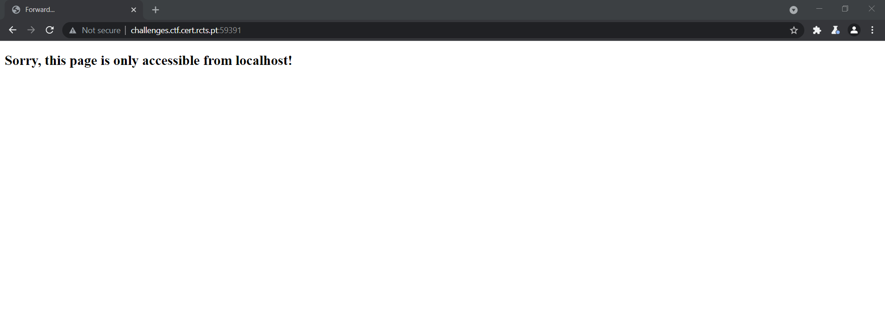
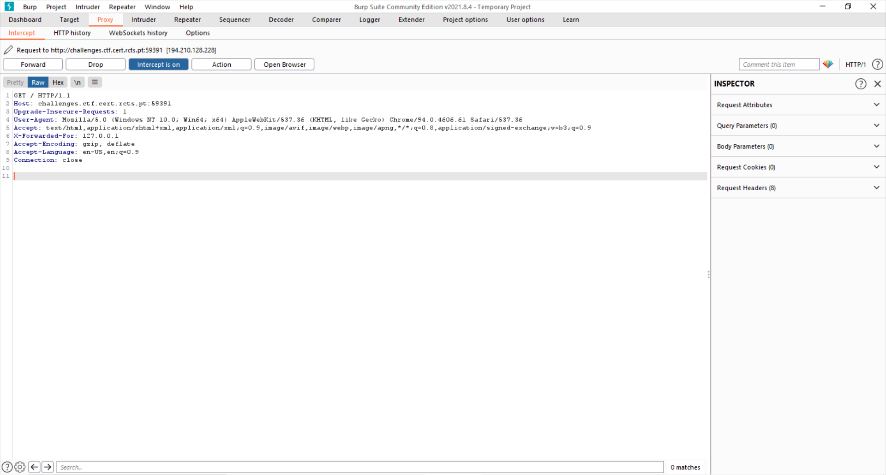
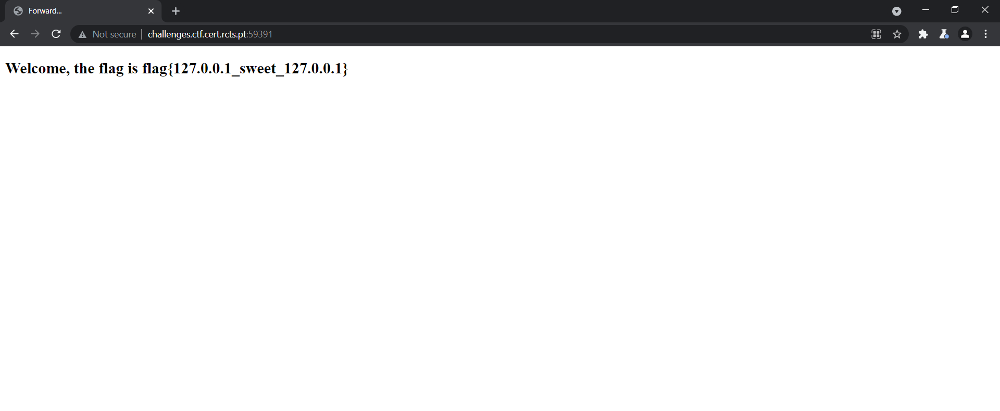

# Jornadas-2021-CTF - 998pts
* Category: Web 
* Name: Sweet Home Sweet
* Level: None
* Description: None
## Solution
* The challenge show a notification `Sorry,this page is only accessiable from localhost!`
* I realized want to read flag, need to used  `X-Forwarded-For`
* <https://developer.mozilla.org/en-US/docs/Web/HTTP/Headers/X-Forwarded-For>
* <https://www.geeksforgeeks.org/http-headers-x-forwarded-for/>

* So i used Burp Suite catch a request and insert `X-Forwarded-For` header with IP 127.0.0.1 => `X-Forwarded-For: 127.0.0.1` 

* Then i `Forward` send to request to server wait few seconds server response flag 

* FLAG `flag{127.0.0.1_sweet_127.0.0.1}`
